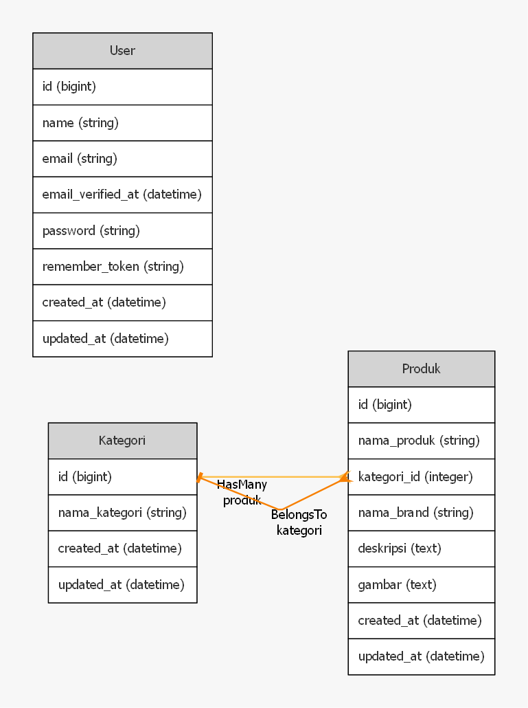

## Project Description

This project is a simple Point of Sale (POS) system designed for small to medium-sized businesses. I created this system to fulfill the administrative requirements where the available features are very simple and there are only 3 tables. This project is only as a result of working on the challenge that has been given so it is not recommended to use it again. This project could be used in the future with the addition of more complex features.

## Key Feature
- Dashboard with summary of total categories and products
- Category management (CRUD operations) + Search feature
- Product management (CRUD operations) + Search feature
- RESTful API for integration

## Database Design

## Screenshots

## Dependency
1. PHP 7.4
2. Laravel 8
3. MySQL
4. Bootstrap 5
5. Node.js and NPM (for compiling assets)

## API Endpoints
### Category Endpoints

| Method      | Endpoint                   | Description                               |
|-------------|----------------------------|-------------------------------------------|
| POST        | `/api/kategori/api`        | Create a new category                     |
| GET         | `/api/kategori/api`        | Retrieve all categories                   |
| POST        | `/api/kategori/api/search` | Search categories                         |
| DELETE      | `/api/kategori/api/{id}`  | Delete a specific category                |
| PUT/PATCH   | `/api/kategori/api/{id}`  | Update a specific category                |
| GET         | `/api/kategori/api/{id}`  | Retrieve details of a specific category   |

### Product Endpoints

| Method      | Endpoint                  | Description                              |
|-------------|---------------------------|------------------------------------------|
| POST        | `/api/produk/api`         | Create a new product                     |
| GET         | `/api/produk/api`         | Retrieve all products                    |
| POST        | `/api/produk/api/search`  | Search products                          |
| DELETE      | `/api/produk/api/{id}`   | Delete a specific product                |
| PUT/PATCH   | `/api/produk/api/{id}`   | Update a specific product                |
| GET         | `/api/produk/api/{id}`   | Retrieve details of a specific product   |

## Installation

1. Clone the repository
2. Run `composer install`
3. Copy `.env.example` to `.env` and configure your database
4. Run `php artisan key:generate`
5. Run `php artisan migrate --seed`
6. Run `npm install && npm run dev`

## License

The Laravel framework is open-sourced software licensed under the [MIT license](https://opensource.org/licenses/MIT).
